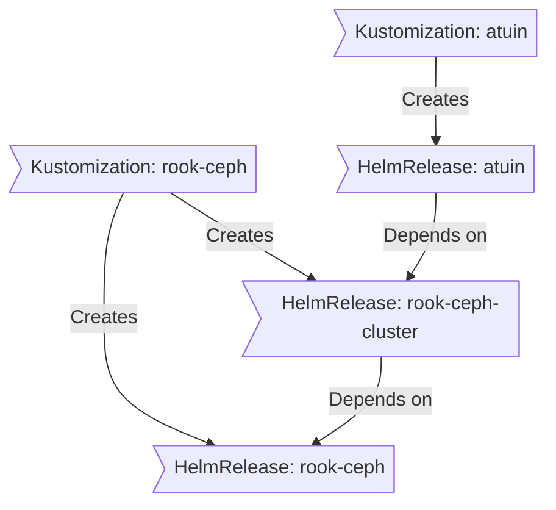

<div align="center">

##  My Home Operations Repository 

_... managed with Flux, Renovate, and GitHub Actions_ 
###  Under constructions...

</div>

##  Overview

This is a mono repository for my (hybrid) home infrastructure and Kubernetes cluster. I try to adhere to Infrastructure as Code (IaC) and GitOps practices using tools like [Ansible](https://www.ansible.com/), [Terraform](https://www.terraform.io/), [Kubernetes](https://kubernetes.io/), [Flux](https://github.com/fluxcd/flux2), [Renovate](https://github.com/renovatebot/renovate), and [GitHub Actions](https://github.com/features/actions).

---

##  Kubernetes

My Kubernetes cluster is deployed with [Talos](https://www.talos.dev). This is a semi-hyper-converged cluster, workloads and block storage are sharing the same available resources on my nodes while I have a separate server with ZFS for NFS/SMB shares, bulk file storage and backups.

### Core Components

- [actions-runner-controller](https://github.com/actions/actions-runner-controller): Self-hosted Github runners.
- [cert-manager](https://github.com/cert-manager/cert-manager): Creates SSL certificates for services in my cluster.
- [cilium](https://github.com/cilium/cilium): eBPF-based networking for my workloads.
- [external-secrets](https://github.com/external-secrets/external-secrets): Managed Kubernetes secrets using [HashiCorp Vault](https://github.com/hashicorp/vault).
- [rook](https://github.com/rook/rook): Distributed block storage for peristent storage.
- [spegel](https://github.com/spegel-org/spegel): Stateless cluster local OCI registry mirror.
- [volsync](https://github.com/backube/volsync): Backup and recovery of persistent volume claims.

### GitOps

[Flux](https://github.com/fluxcd/flux2) watches the clusters in my [kubernetes](./kubernetes/) folder (see Directories below) and makes the changes to my clusters based on the state of my Git repository.

The way Flux works for me here is it will recursively search the `kubernetes/apps` folder until it finds the most top level `kustomization.yaml` per directory and then apply all the resources listed in it. That aforementioned `kustomization.yaml` will generally only have a namespace resource and one or many Flux kustomizations (`ks.yaml`). Under the control of those Flux kustomizations there will be a `HelmRelease` or other resources related to the application which will be applied.

[Renovate](https://github.com/renovatebot/renovate) watches my **entire** repository looking for dependency updates, when they are found a PR is automatically created. When some PRs are merged Flux applies the changes to my cluster.

### Directories

This Git repository contains the following directories under [k8s](./k8s/).

```sh
📁 k8s
├── 📁 apps       # applications
├── 📁 components # re-useable kustomize components
└── 📁 flux       # flux system configuration
```

### Flux Workflow

This is a high-level look how Flux deploys my applications with dependencies. In most cases a `HelmRelease` will depend on other `HelmRelease`'s, in other cases a `Kustomization` will depend on other `Kustomization`'s, and in rare situations an app can depend on a `HelmRelease` and a `Kustomization`. The example below shows that `atuin` won't be deployed or upgrade until the `rook-ceph-cluster` Helm release is installed or in a healthy state.



### Networking


---

##  Cloud Dependencies

While most of my infrastructure and workloads are self-hosted I do rely upon the cloud for certain key parts of my setup. This saves me from having to worry about three things. (1) Dealing with chicken/egg scenarios, and (2) services I critically need whether my cluster is online or not

| Service                                    | Use                                                            | Cost           |
| ------------------------------------------ | -------------------------------------------------------------- | -------------- |
| [AWS](https://aws.amazon.com)              | S3, CloudFront, and AWS KMS for Vault auto-unseal              | ~1/mth         |
| [OVHcloud](https://www.ovhcloud.com)       | VPS for Vault and other services                               | ~5/mth         |
| [Cloudflare](https://www.cloudflare.com/)  | Domain                                                         | ~$20/yr        |
| [GitHub](https://github.com/)              | Hosting this repository and continuous integration/deployments | Free           |
| [BorgBase](https://www.borgbase.com)       | Off-site backups                                               | $24/yr         |
| [Pushover](https://pushover.net/)          | Kubernetes Alerts and application notifications                | $5 OTP         |
| [Healthchecks.io](https://healthchecks.io) | Watchdog alerts                                                | Free           |
|                                            |                                                                | Total: ~$10/mo |

---
##  Hardware

| Device            | CPU | Memory | OS Disk     | Data Disk                                   | OS    | Purpose                      |
| ----------------- | --- | ------ | ----------- | ------------------------------------------- | ----- | ---------------------------- |
| n5105 fw          | 4   | 16 GB  | 128 GB NVMe | -                                           | pve   | opnsense / management VMs    |
| n5105 nas         | 4   | 16 GB  | 512 GB NVMe | 1x 1 TB NVMe<br>2x 14 TB HDD<br>2x 6 TB HDD | pve   | backups / media / containers |
| nuc 8             | 8   | 16 GB  | 512 GB NVMe | -                                           | pve   | VMs                          |
| nuc 12 pro        | 16  | 64 GB  | 1 TB NVMe   | 1x 500 GB SSD                               | talos | talos (k8s)                  |
| opti 7050         | 4   | 32 GB  | 256 GB NVMe | 1x 500 GB SSD                               | talos | talos (k8s)                  |
| opti 7060         | 6   | 32 GB  | 1 TB NVMe   | 1x 500 GB SSD                               | talos | talos (k8s)                  |
| pi4               | 4   | 4 GB   | 32 GB SD    | -                                           | pikvm | kvm                          |
| unifi switch      | -   | -      | -           | -                                           | -     |                              |
| unifi switch mini | -   | -      | -           | -                                           | -     |                              |
| unifi ap          | -   | -      | -           | -                                           | -     |                              |

---

##  Gratitude and Thanks

Massive thanks to **onedr0p** for his [cluster-template](https://github.com/onedr0p/cluster-template) and to all the people who donate their time to the [Home Operations](https://discord.gg/home-operations) Discord community. 
